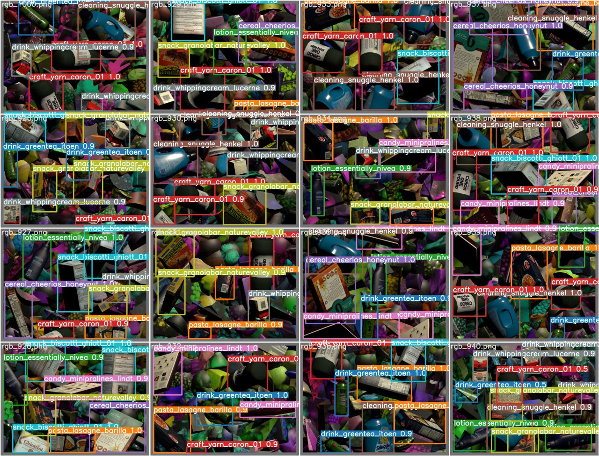

# YOLOv5 with Synthetic data
Training/Application of the YOLOv5 object detection algorithm on a synthetic dataset generated in Unity and its Perception module

## Perception module 
Unity Perception module tutorial is available at:

https://github.com/Unity-Technologies/com.unity.perception/blob/master/com.unity.perception/Documentation~/Tutorial/Phase1.md

## YOLOv5
YOLOv5 implementation used in this repository is available at:

https://github.com/ultralytics/yolov5

## Results

    

